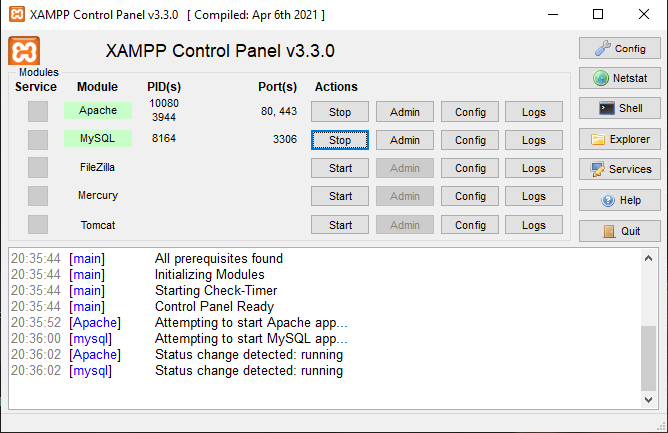
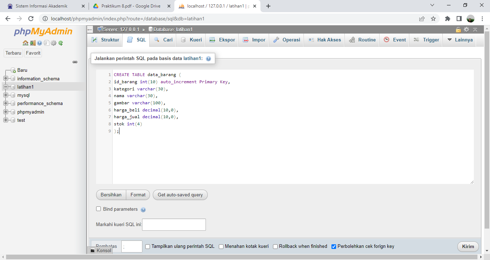
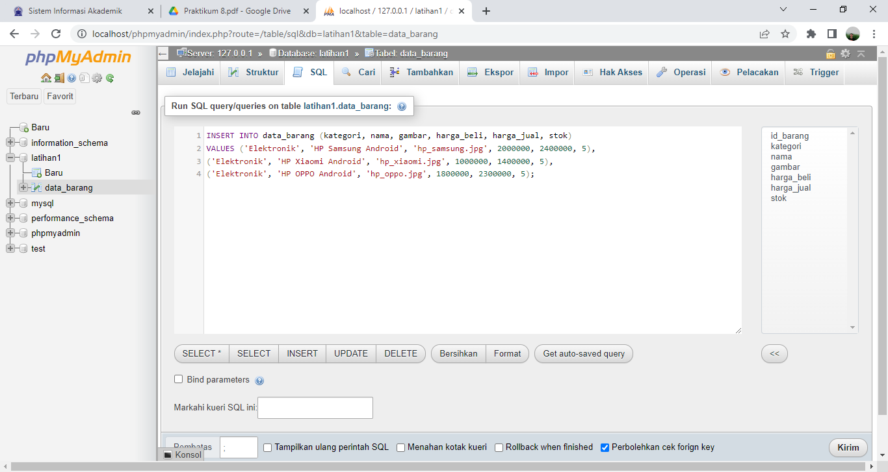
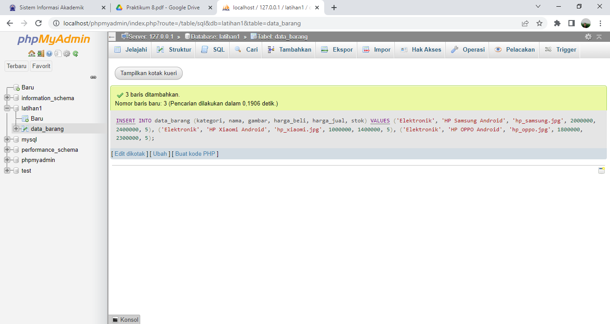
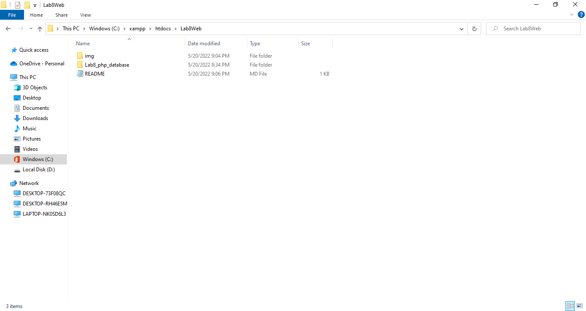
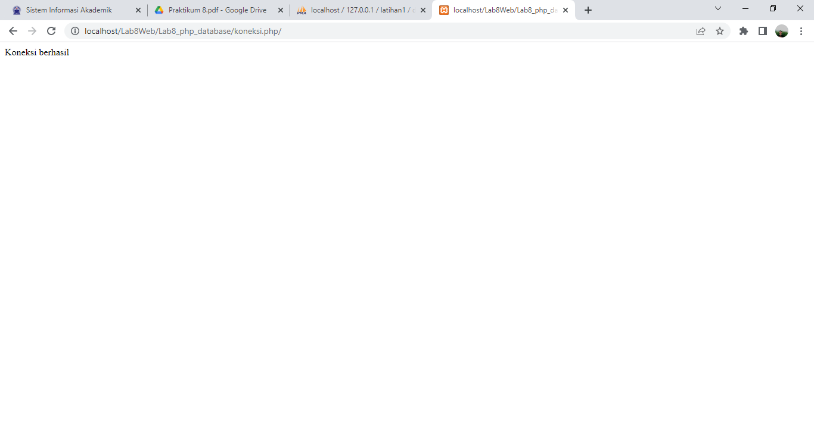
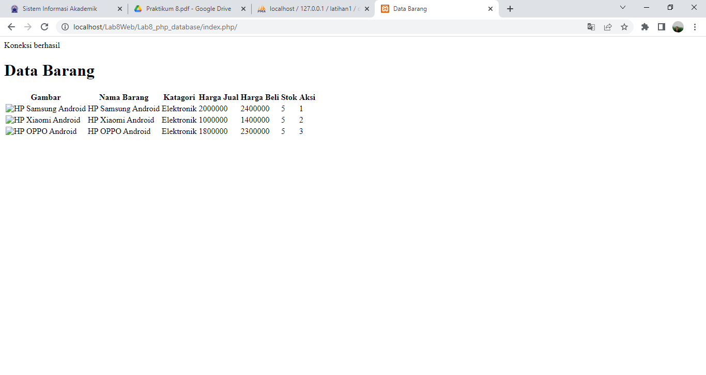
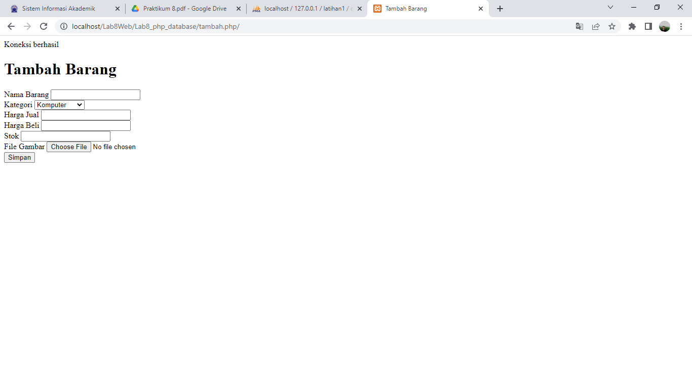
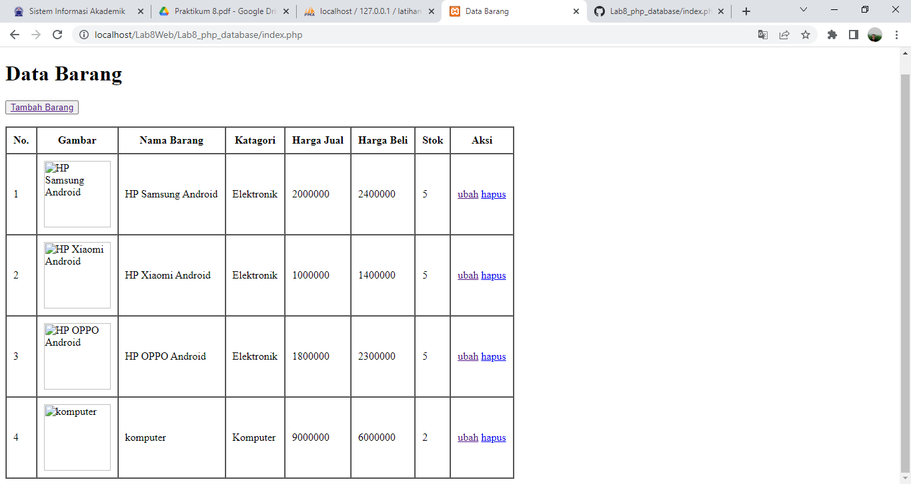

## Nama : Mohammad Sofiyan
## Nim  : 312010225
## Kelas: TI.20.A2
## Matkkul : Pemrograman Web

## langkah pertama 

Menjalankan xampp Server 

## langkah kedua 

Membuat Tabel database

## langkah ketiga

Data berhasil di tambahkan 

## langkah keempat 

Melihat localhost Lab8Web

## langkah kelima 

database terhubung 

## langkah keenam

Membuat index php

## langkah ketujuh 

perogram tambah barang atau create

## langkah kedelapan 

mengubah data 

## langkah kesembilan 
![hapus]
untuk mengapus kelik hapus dan jika ingin tambah barang kelik tambahbarang 